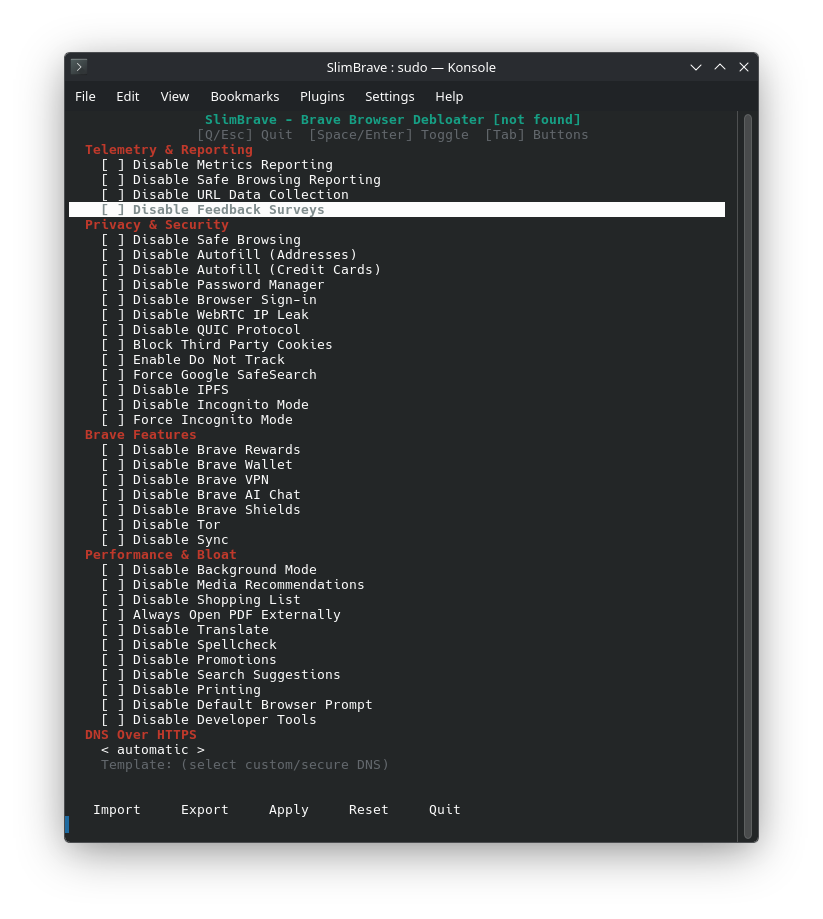

<div align="center">

# SlimBrave


**Debloat and harden Brave Browser on Linux and Windows.**

[](https://python.org)
[]()
[](LICENSE)
[]()
[]()

SlimBrave uses Chromium enterprise managed policies to disable telemetry,
bloat, and unwanted features from Brave Browser. No browser extensions,
no hacks — just clean policy enforcement that Brave respects natively.

---



*Interactive curses TUI — zero dependencies, runs in any terminal.*

</div>

---

## Quick Start — Linux

```bash
git clone https://github.com/ChaoticSi1ence/SlimBrave.git
cd SlimBrave
sudo python3 slimbrave.py
```

That's it. No `pip install`, no `jq`, no external dependencies. Just Python 3 and root.

### CLI Mode (non-interactive)

```bash
sudo python3 slimbrave.py --import "./Presets/Maximum Privacy Preset.json"
sudo python3 slimbrave.py --export ~/SlimBraveSettings.json
sudo python3 slimbrave.py --reset
```

After applying, restart Brave and verify at `brave://policy`.

---

## Quick Start — Windows

```powershell
iwr "https://raw.githubusercontent.com/ltx0101/SlimBrave/main/SlimBrave.ps1" -OutFile "SlimBrave.ps1"; .\SlimBrave.ps1
```

Requires Administrator privileges.

---

## Features

### Telemetry & Reporting
- Disable Metrics Reporting
- Disable Safe Browsing Reporting
- Disable URL Data Collection
- Disable Feedback Surveys

### Privacy & Security
- Disable Safe Browsing
- Disable Autofill (Addresses & Credit Cards)
- Disable Password Manager
- Disable Browser Sign-in
- Disable WebRTC IP Leak
- Disable QUIC Protocol
- Block Third Party Cookies
- Enable Do Not Track
- Force Google SafeSearch
- Disable IPFS
- Disable / Force Incognito Mode

### Brave Features
- Disable Brave Rewards
- Disable Brave Wallet
- Disable Brave VPN
- Disable Brave AI Chat
- Disable Brave Shields
- Disable Tor
- Disable Sync

### Performance & Bloat
- Disable Background Mode
- Disable Media Recommendations
- Disable Shopping List
- Always Open PDF Externally
- Disable Translate
- Disable Spellcheck
- Disable Promotions
- Disable Search Suggestions
- Disable Printing
- Disable Default Browser Prompt
- Disable Developer Tools

### DNS Over HTTPS
- Four modes: `automatic`, `off`, `secure`, `custom`
- Custom DoH template URL support (e.g. `https://cloudflare-dns.com/dns-query`)
- Inline editable template field in the TUI

---

## CLI Reference

| Flag | Description |
|------|-------------|
| `--import PATH` | Import a SlimBrave JSON config and apply policies |
| `--export PATH` | Export current policy to a SlimBrave JSON config |
| `--reset` | Remove the managed policy file |
| `--policy-file PATH` | Override policy file path (default: `/etc/brave/policies/managed/slimbrave.json`) |
| `--doh-templates URL` | Set custom DNS-over-HTTPS template URL |
| `-h`, `--help` | Show help |

Import/export uses the same JSON format as the Windows PowerShell version —
configs are cross-platform compatible.

---

<details>
<summary><strong>Presets</strong></summary>

### Maximum Privacy Preset
- Telemetry: Blocks all reporting (metrics, safe browsing, URL collection, feedback).
- Privacy: Disables autofill, password manager, sign-in, WebRTC leaks, QUIC, and forces Do Not Track.
- Brave Features: Kills Rewards, Wallet, VPN, AI Chat, Tor, and Sync.
- Performance: Disables background processes, recommendations, and bloat.
- DNS: Uses plain DNS (no HTTPS) to prevent potential logging by DoH providers.
- Best for: Paranoid users, journalists, activists, or anyone who wants Brave as private as possible.

### Balanced Privacy Preset
- Telemetry: Blocks all tracking but keeps basic safe browsing.
- Privacy: Blocks third-party cookies, enables Do Not Track, but allows password manager and autofill for addresses.
- Brave Features: Disables Rewards, Wallet, VPN, and AI features.
- Performance: Turns off background services and ads.
- DNS: Uses automatic DoH (lets Brave choose the fastest secure DNS).
- Best for: Most users who want privacy but still need convenience features.

### Performance Focused Preset
- Telemetry: Only blocks metrics and feedback surveys (keeps some safe browsing).
- Brave Features: Disables Rewards, Wallet, VPN, and AI to declutter the browser.
- Performance: Kills background processes, shopping features, and promotions.
- DNS: Automatic DoH for a balance of speed and security.
- Best for: Users who want a faster, cleaner Brave without extreme privacy tweaks.

### Developer Preset
- Telemetry: Blocks all reporting.
- Brave Features: Disables Rewards, Wallet, and VPN but keeps developer tools.
- Performance: Turns off background services and ads.
- DNS: Automatic DoH (default secure DNS).
- Best for: Developers who need dev tools but still want telemetry and ads disabled.

### Strict Parental Controls Preset
- Privacy: Blocks incognito mode, forces Google SafeSearch, and disables sign-in.
- Brave Features: Disables Rewards, Wallet, VPN, Tor, and dev tools.
- DNS: Uses custom DoH (can be set to a family-friendly DNS like Cloudflare for Families).
- Best for: Parents, schools, or workplaces that need restricted browsing.

</details>

---

## How It Works

SlimBrave writes Chromium [managed enterprise policies](https://chromeenterprise.google/policies/)
to `/etc/brave/policies/managed/slimbrave.json`. Brave reads this directory on
startup and enforces the policies — no browser modifications needed.

- Auto-detects Brave installations: Arch (`brave-bin`), deb/rpm, Flatpak, Snap, and PATH fallback
- Reads existing policies on startup and pre-checks matching features
- Full overwrite on Apply — unchecked features are cleanly removed
- Import/export compatible with Windows PowerShell version (handles UTF-16 BOM encoding)

---

<details>
<summary><strong>Requirements</strong></summary>

**Linux:**
- Python 3 (no external dependencies)
- Root privileges (`sudo`)
- Brave Browser installed (any packaging method)

**Windows:**
- Windows 10/11
- PowerShell
- Administrator privileges

</details>

<details>
<summary><strong>Windows: "Running Scripts is Disabled on this System"</strong></summary>

Run this command in PowerShell:

```powershell
Set-ExecutionPolicy -ExecutionPolicy RemoteSigned
```

</details>

---

### Roadmap
- [x] Add preset configurations (Privacy, Performance, etc.)
- [x] Import/export settings (cross-platform compatible)
- [x] Add Linux support with full interactive TUI
- [x] DNS-over-HTTPS with custom template URLs
- [x] CLI mode for scripting and automation

---

<div align="center">

**Like this project? Give it a star!**

Made with Python and PowerShell.

[](LICENSE)

</div>
