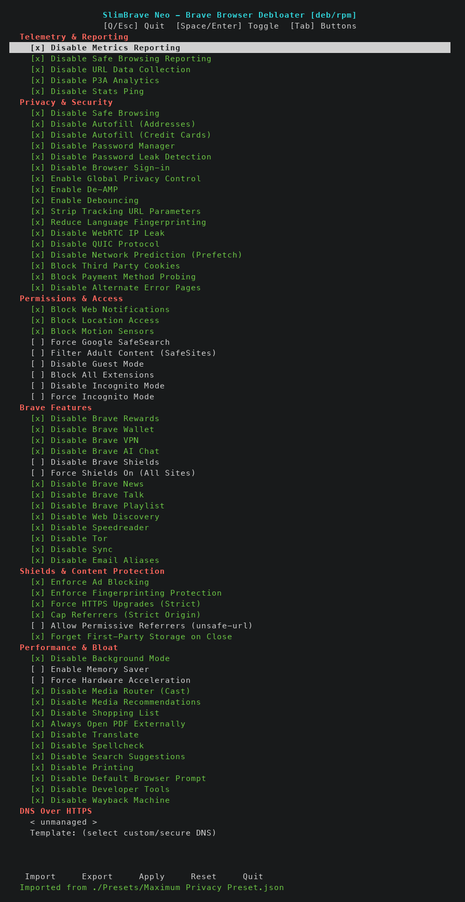

<div align="center">

# SlimBrave Neo


**Debloat and harden Brave, Google Chrome, and Microsoft Edge on Linux, macOS, and Windows.**

[](https://python.org)
[]()
[](LICENSE)
[]()
[]()
[]()

SlimBrave Neo uses Chromium enterprise managed policies to disable telemetry, bloat, and unwanted features in Brave Browser — and in Google Chrome and Microsoft Edge too. No browser extensions, no hacks, just clean policy enforcement the browsers respect natively. Brave stays the default; pass `--browser chrome` / `--browser edge` (or `-Browser` on Windows) to manage the others. Edge is supported on Windows and macOS only: Microsoft's policy documentation doesn't cover Edge on Linux, so there is nothing authoritative to audit a Linux Edge catalog against.

</div>

> [!IMPORTANT]
> **The only official source of SlimBrave Neo is this repository:**
> [`github.com/ChaoticSi1ence/SlimBrave-Neo`](https://github.com/ChaoticSi1ence/SlimBrave-Neo)
>
> This project ships **source code only**. Python and PowerShell scripts you can read before running.
> **There are no official `.exe`, `.msi`, `.dmg`, `.pkg`, installers, or compiled binaries.**
> If you find a download claiming to be SlimBrave-Neo elsewhere, it is not from this project. See [`SECURITY.md`](SECURITY.md).

> [!NOTE]
> **Linux users: consider [Brave Origin](https://brave.com/origin/linux/nightly/) first.**
> Brave Origin is a free, official Brave variant that ships with telemetry and bloat already removed. If you just want a clean Brave without configuration, that's the simpler path.
>
> The Linux version of SlimBrave Neo is still fully supported, and is the right tool if you want fine-grained control over individual policies, custom presets, or your own DoH templates beyond what Origin provides out of the box.

<div align="center">

---



*Interactive curses TUI with the Maximum Privacy preset imported. Zero dependencies, runs in any terminal.*

</div>

---

## Quick Start

### Linux

```bash
git clone https://github.com/ChaoticSi1ence/SlimBrave-Neo.git
cd SlimBrave-Neo
sudo python3 slimbrave-linux.py
```

That's it. No `pip install`, no `jq`, no external dependencies. Just Python 3 and root.

**CLI mode (non-interactive):**

```bash
sudo python3 slimbrave-linux.py --import "./Presets/Brave/Maximum Privacy Preset.json"
sudo python3 slimbrave-linux.py --export ~/SlimBraveNeoSettings.json
sudo python3 slimbrave-linux.py --reset

# Manage Google Chrome instead of Brave (policies at /etc/opt/chrome):
sudo python3 slimbrave-linux.py --browser chrome
sudo python3 slimbrave-linux.py --browser chrome --import "./Presets/Chrome/Maximum Privacy Preset.json"
```

**Multiple Brave channels (Stable / Beta / Nightly):** Brave hardcodes the managed-policy directory to `/etc/brave/policies` for every channel, so a single policy file applies to all of them — no per-channel selector is needed. If multiple channels are installed, leaked Shields exceptions are scrubbed from each channel's user-data directory and "Brave is running" detection covers all installed channels.

After applying, restart Brave and verify at `brave://policy`.

### macOS

```bash
git clone https://github.com/ChaoticSi1ence/SlimBrave-Neo.git
cd SlimBrave-Neo
sudo python3 slimbrave-mac.py
```

Requires root. Policies are written to `/Library/Managed Preferences/com.brave.Browser.plist` by default; with `--persist on` an Apple Configuration Profile is installed instead.

**Persistence on macOS (Apple Silicon / macOS 13+).** On modern macOS, `cfprefsd` and `mdmclient` may clear directly-written `/Library/Managed Preferences/*.plist` files at reboot when no Configuration Profile backs them, so policies don't always survive a restart. SlimBrave Neo offers two modes:

| Mode | What it does | Persists | User action |
|------|--------------|----------|-------------|
| `off` (default) | Writes the plist only | may reset on macOS 13+ | just `sudo` |
| `on` | Installs an Apple Configuration Profile via System Settings | yes, durable | `sudo` + one-time GUI install |

When `--persist` is omitted on the CLI, the mode currently installed on the Mac is reused, so a re-run never silently demotes an installed profile back to plist-only. A fresh install defaults to `off`.

When you click Apply in the TUI, SlimBrave Neo asks two macOS-only questions in order: which Brave channels to manage (only when more than one is installed), then whether to persist across reboots. Both prompts have a sticky default — Enter keeps whichever scope and mode are currently installed.

```bash
sudo python3 slimbrave-mac.py --import "./Presets/Brave/Maximum Privacy Preset.json" --persist on
sudo python3 slimbrave-mac.py --import "./Presets/Brave/Maximum Privacy Preset.json" --persist off
sudo python3 slimbrave-mac.py --reset

# Manage Chrome or Edge instead of Brave:
sudo python3 slimbrave-mac.py --browser chrome
sudo python3 slimbrave-mac.py --browser edge --import "./Presets/Edge/Debloat Preset.json"
```

**Finishing the Configuration Profile install (macOS 26).** With `--persist on`, SlimBrave Neo writes a `.mobileconfig` and opens System Settings, but macOS 11+ disallows CLI-driven profile installs so you finish the step in the GUI: a "Profile Downloaded" notification appears; in System Settings click **General** → **Device Management**, scroll down to **Downloaded**, double-click **SlimBrave Neo - Brave Policy**, click **Install**, and enter your login password. Policies then take effect immediately and persist across reboots. To uninstall, run `--reset` or remove the profile under the same Device Management pane. Reference: [Apple — Install configuration profiles on Mac](https://support.apple.com/guide/mac-help/mh35561/mac).

**CLI mode (non-interactive):**

```bash
sudo python3 slimbrave-mac.py --import "./Presets/Brave/Maximum Privacy Preset.json"
sudo python3 slimbrave-mac.py --export ~/SlimBraveNeoSettings.json
sudo python3 slimbrave-mac.py --reset
sudo python3 slimbrave-mac.py --import preset.json --channels stable,beta
sudo python3 slimbrave-mac.py --import preset.json --persist on
```

After applying, restart Brave and verify at `brave://policy`.

### Windows

```powershell
iwr "https://raw.githubusercontent.com/ChaoticSi1ence/SlimBrave-Neo/main/SlimBrave.ps1" -OutFile "SlimBrave.ps1"; .\SlimBrave.ps1
```

To manage Google Chrome or Microsoft Edge instead of Brave:

```powershell
.\SlimBrave.ps1 -Browser chrome
.\SlimBrave.ps1 -Browser edge
```

Requires Administrator privileges. Hover over any option in the app for a plain-English description of what it does and the exact policy it writes. The app follows your Windows light/dark theme, and on low-resolution displays (e.g. 720p/768p) automatically reflows from two columns into three shorter ones so no options or buttons run off the bottom of the screen.

---

## Features

Each browser gets its own audited catalog. The sections below show the full Brave set; Chrome and Edge share every Chromium-common toggle (marked keys excepted) plus their own vendor section. Rows that don't exist for the selected browser simply don't appear in the UI.

### Telemetry & Reporting
- Disable Metrics Reporting
- Disable Safe Browsing Reporting
- Disable URL Data Collection
- Disable P3A Analytics
- Disable Stats Ping

### Privacy & Security
- Disable Safe Browsing
- Disable Autofill (Addresses & Credit Cards)
- Disable Password Manager
- Disable Password Leak Detection (the online breach-list credential check)
- Disable Browser Sign-in
- Enable Global Privacy Control
- Enable De-AMP (strip Google AMP wrappers)
- Enable Debouncing (skip known tracking redirect hops)
- Strip Tracking URL Parameters
- Reduce Language Fingerprinting
- Disable WebRTC IP Leak
- Disable QUIC Protocol
- Disable Network Prediction (no DNS prefetch / preconnect for links you never click)
- Block Third Party Cookies
- Block Payment Method Probing (sites' `canMakePayment` always answers "none saved")
- Disable Alternate Error Pages

### Permissions & Access
Site-permission defaults plus the escape hatches (guest, incognito, extensions) that would otherwise bypass the rest of the policy set:
- Block Web Notifications
- Block Location Access
- Block Motion Sensors (a fingerprinting vector)
- Force Google SafeSearch
- Filter Adult Content (SafeSites URL filter)
- Disable Guest Mode (guest windows bypass profile restrictions)
- Block All Extensions (blocks new installs and disables existing ones — lockdown/parental setups)
- Disable / Force Incognito Mode (mutually exclusive)

### Brave Features (Brave only)
- Disable Brave Rewards
- Disable Brave Wallet
- Disable Brave VPN
- Disable Brave AI Chat
- Disable Brave Shields / Force Shields On for all sites (mutually exclusive)
- Disable Brave News
- Disable Brave Talk
- Disable Brave Playlist
- Disable Web Discovery
- Disable Speedreader
- Disable Tor
- Disable Email Aliases

*(Disable Sync lives under Privacy & Security — `SyncDisabled` is a Chromium-common key that works in all three browsers.)*

### Chrome Features (Chrome only)
Verified against Chromium's policy source; the four Privacy Sandbox policies were considered and rejected — Google has deprecated them:
- Disable Feedback Collection
- Disable Chrome Labs
- Disable Search Side Panel
- Disable Gemini Integrations (Chrome 137+; Windows/macOS — Google doesn't ship the policy on Linux)
- Restrict Field Trials (Critical Only — stops Google A/B experiments; security-critical variations still apply)

### Edge Features (Edge only)
Verified against Microsoft's per-policy Edge documentation. Edge renames several Chromium policies, so its catalog carries the equivalents: InPrivate instead of Incognito, `WebRtcLocalhostIpHandling`, SmartScreen instead of Safe Browsing, Password Monitor instead of Leak Detection, Efficiency Mode instead of Memory Saver, and `DiagnosticData` instead of `MetricsReportingEnabled`:
- Minimize Diagnostic Data, Disable Personalization Reporting, Disable Feedback Collection
- Disable Sidebar & Copilot Hub, Collections, Shopping Assistant, Microsoft Rewards, Wallet Checkout
- Disable New Tab MSN Feed, Asset Delivery Service, Spotlight Recommendations (Windows), Startup Boost (Windows)
- Enable Sleeping Tabs, Enable Efficiency Mode
- Disable SmartScreen, Disable Password Monitor, Disable WebRTC IP Leak, Force Bing SafeSearch (Strict)
- Disable / Force InPrivate Mode (mutually exclusive)

### Shields & Content Protection (Brave only)
Pin Brave's own protection defaults as managed policy so they can't be weakened per-site or in settings (requires Brave 1.83+):
- Enforce Ad Blocking
- Enforce Fingerprinting Protection
- Force HTTPS Upgrades (Strict — sites that can't serve HTTPS show an interstitial)
- Cap Referrers (Strict Origin) / Allow Permissive Referrers (mutually exclusive — both unchecked leaves referrer behavior unmanaged)
- Forget First-Party Storage on Close

> **Note on referrers:** with no referrer policy applied, Brave still caps cross-origin referrers by default, but you can loosen it per-site by lowering Shields on that site. "Allow Permissive Referrers" makes the loosening global as managed policy (`DefaultBraveReferrersSetting: 1`) — sites that request `unsafe-url` get your full referring URL cross-origin. It exists for compatibility with sites that break under capped referrers; it weakens privacy and is deliberately excluded from every preset.

### Performance & Bloat
- Disable Background Mode (Windows/Linux only — the policy doesn't exist on macOS)
- Enable Memory Saver (discard inactive tabs to free RAM)
- Force Hardware Acceleration (keeps rendering and video decode on the GPU; needs a restart)
- Disable Media Router (Cast, including its background LAN device discovery; needs a restart)
- Disable Media Recommendations
- Disable Shopping List
- Always Open PDF Externally
- Disable Translate
- Disable Spellcheck
- Disable Search Suggestions
- Disable Printing
- Disable Default Browser Prompt
- Disable Developer Tools
- Disable Wayback Machine

### DNS Over HTTPS
- `unmanaged` by default — no DNS policy is written, so Brave's own DNS settings stay user-controlled
- Four managed modes: `automatic`, `off`, `secure`, `custom` (`off` force-disables DoH as policy)
- Custom DoH template URL support (e.g. `https://cloudflare-dns.com/dns-query`)
- Inline editable template field in the TUI

---

## CLI Reference

| Flag | Description |
|------|-------------|
| `--browser NAME` | Which browser to manage: `brave` (default), `chrome`, or `edge` (`edge` on macOS/Windows only). Windows uses `-Browser NAME`. |
| `--import PATH` | Import a SlimBrave Neo JSON config and apply policies (the config's `Browser` field must match the selected browser) |
| `--export PATH` | Export current policy to a SlimBrave Neo JSON config |
| `--reset` | Remove the managed policy file |
| `--policy-file PATH` | Override policy file path |
| `--doh-templates URL` | Set custom DNS-over-HTTPS template URL |
| `--channels LIST` | Comma-separated channels to target (`stable,beta,nightly`; Linux also accepts `dev`). Default `auto` = all detected. macOS writes one plist per channel; Linux always shares a single policy file. |
| `--persist MODE` | macOS persistence: `off` (plist only; may reset after reboot on macOS 13+) or `on` (install an Apple Configuration Profile via System Settings; durable, Apple-recommended). Omitted = reuse whatever mode is currently installed; falls back to `off` if nothing is. Linux ignores this flag — its `/etc/brave/policies` file is already durable. |
| `-h`, `--help` | Show help |

Import/export uses the same JSON format as the Windows PowerShell version. Configs are cross-platform compatible.

---

<details>
<summary><strong>Presets</strong></summary>

Presets live in per-browser folders — `Presets/Brave/`, `Presets/Chrome/`, `Presets/Edge/` — and carry a `"Browser"` field; importing one into the wrong browser is rejected with a clear error instead of silently skipping most keys. The Brave set is described below. Chrome mirrors it (Maximum Privacy, Balanced Privacy, Performance Focused, Developer, Strict Parental Controls) using Chrome's catalog — its Balanced preset deliberately leaves browser sign-in and sync available, since those are core Chrome conveniences. Edge gets Maximum Privacy, Balanced Privacy, Performance Focused, Strict Parental Controls, and a dedicated **Debloat** preset that strips the MSN feed, sidebar/Copilot, Rewards, shopping, Collections, Spotlight, and startup boost without touching protective features like SmartScreen.

### Maximum Privacy Preset
- **Telemetry:** Blocks all reporting (metrics, safe browsing, URL collection, feedback).
- **Privacy:** Disables autofill, password manager, leak detection, sign-in, WebRTC leaks, QUIC, and network prediction; blocks payment-method probing, web notifications, location access, and motion sensors; enforces Global Privacy Control. (Location is fully blocked, not "ask" — maps and delivery sites need addresses typed manually; uncheck "Block Location Access" if that is too strict.)
- **Brave Features:** Kills Rewards, Wallet, VPN, AI Chat, Tor, Sync, and Email Aliases.
- **Shields:** Pins ad blocking, fingerprinting protection, strict HTTPS, capped referrers, and forget-on-close storage as managed policy.
- **Performance:** Disables background processes, Cast device discovery, media recommendations, and bloat.
- **DNS:** Left unmanaged. Forcing DoH off would hand every DNS query to your ISP in cleartext, while forcing DoH on concentrates that visibility at the DoH provider — which trade-off is right depends on who you distrust more, so the preset leaves the choice to you (set it manually in the DNS section if you have a preference).
- **Note:** No longer forces incognito-only browsing (earlier versions set `IncognitoModeAvailability: 2`, which silently disabled history, persistent logins, and most extensions). Forget-on-close storage covers the privacy goal; the Force Incognito toggle is still available manually.
- **Best for:** Paranoid users, journalists, activists, or anyone who wants Brave as private as possible.

### Balanced Privacy Preset
- **Telemetry:** Blocks all tracking but keeps basic safe browsing.
- **Privacy:** Blocks third-party cookies, payment-method probing, and network prediction; enables Global Privacy Control — but allows password manager and autofill for addresses.
- **Brave Features:** Disables Rewards, Wallet, VPN, and AI features.
- **Performance:** Turns off background services, media recommendations, and ads.
- **DNS:** Uses automatic DoH (lets Brave choose the fastest secure DNS).
- **Best for:** Most users who want privacy but still need convenience features.

### Performance Focused Preset
- **Telemetry:** Blocks metrics reporting, P3A analytics, and the daily stats ping (Safe Browsing stays untouched).
- **Brave Features:** Disables Rewards, Wallet, VPN, AI, Speedreader, and Web Discovery to declutter the browser.
- **Performance:** Forces Memory Saver and hardware acceleration on; kills background processes, Cast device discovery, media recommendations, shopping features, and promotions. Network prediction is deliberately left on — prefetch makes browsing faster at a small privacy cost, which is the right trade for this preset.
- **DNS:** Automatic DoH for a balance of speed and security.
- **Best for:** Users who want a faster, cleaner Brave without extreme privacy tweaks.

### Developer Preset
- **Telemetry:** Blocks all reporting.
- **Privacy:** Disables alternate error pages so you always see the real network error, never a suggestion page.
- **Brave Features:** Disables Rewards, Wallet, and VPN but keeps developer tools, printing, spellcheck, and the built-in PDF viewer.
- **Performance:** Turns off background services, media recommendations, and ads.
- **DNS:** Automatic DoH (default secure DNS).
- **Best for:** Developers who need dev tools but still want telemetry and ads disabled.

### Strict Parental Controls Preset
- **Privacy:** Blocks incognito mode **and guest mode** (a guest window would bypass every other restriction), forces Google SafeSearch plus the built-in SafeSites adult-content filter, and disables sign-in.
- **Extensions:** Blocks all extension installs and disables existing ones — a proxy or VPN extension would bypass the DNS filter.
- **Brave Features:** Disables Rewards, Wallet, VPN, Tor, and dev tools.
- **DNS:** Uses custom DoH (can be set to a family-friendly DNS like Cloudflare for Families).
- **Best for:** Parents, schools, or workplaces that need restricted browsing.

</details>

---

## How It Works

SlimBrave Neo writes Chromium [managed enterprise policies](https://chromeenterprise.google/policies/) to platform-specific locations. Brave reads these on startup and enforces the policies. No browser modifications needed.

| Platform | Browser | Policy Location |
|----------|---------|----------------|
| Linux | Brave | `/etc/brave/policies/managed/slimbrave.json` (shared across all channels) |
| Linux | Chrome | `/etc/opt/chrome/policies/managed/slimbrave.json` (shared across all channels) |
| macOS — `--persist off` | Brave | `/Library/Managed Preferences/com.brave.Browser{,.beta,.nightly}.plist` (one per selected channel) |
| macOS — `--persist off` | Chrome / Edge | `/Library/Managed Preferences/com.google.Chrome.plist` / `com.microsoft.Edge.plist` (every channel reads the shared domain) |
| macOS — `--persist on` | all | Apple Configuration Profile (one per browser) installed via System Settings → General → Device Management |
| Windows | Brave | `HKLM:\SOFTWARE\Policies\BraveSoftware\Brave` |
| Windows | Chrome | `HKLM:\SOFTWARE\Policies\Google\Chrome` |
| Windows | Edge | `HKLM:\SOFTWARE\Policies\Microsoft\Edge` |

**Additional behavior:**
- Auto-detects Brave installations: Arch (`brave-bin`), deb/rpm, Flatpak, Snap, macOS App (Stable / Beta / Nightly), and PATH fallback
- Reads existing policies on startup and pre-checks matching features; on macOS, the Apply-time channel prompt pre-ticks channels that already have a SlimBrave-managed policy (sticky default)
- Full overwrite on Apply, so unchecked features are cleanly removed
- Import/export compatible with Windows PowerShell version (handles UTF-16 BOM encoding)

---

<details>
<summary><strong>Requirements</strong></summary>

**Linux:**
- Python 3 (no external dependencies)
- Root privileges (`sudo`)
- Brave Browser installed (any packaging method)

**macOS:**
- Python 3 (no external dependencies)
- Root privileges (`sudo`)
- Brave Browser installed

**Windows:**
- Windows 10/11
- PowerShell
- Administrator privileges

</details>

<details>
<summary><strong>Windows: "Running Scripts is Disabled on this System"</strong></summary>

Run this command in PowerShell:

```powershell
Set-ExecutionPolicy -ExecutionPolicy RemoteSigned
```

</details>

---

## Roadmap

- [x] Add preset configurations (Privacy, Performance, etc.)
- [x] Import/export settings (cross-platform compatible)
- [x] Add Linux support with full interactive TUI
- [x] DNS-over-HTTPS with custom template URLs
- [x] CLI mode for scripting and automation
- [x] macOS support via managed plist policies
- [x] Multi-channel support on macOS (Stable / Beta / Nightly)

---

## Contributors

- **[@alsyundawy](https://github.com/alsyundawy)** - macOS version
- **[@zhaoJianNet](https://github.com/zhaoJianNet)** - macOS refinements
---

<div align="center">

**Like this project? Give it a star!**

Made with Python and PowerShell.

[](LICENSE)

</div>
