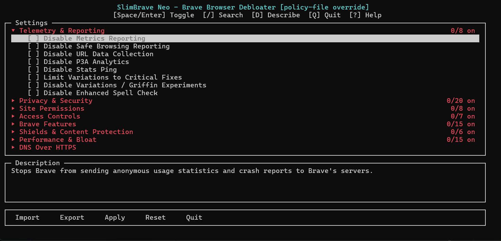
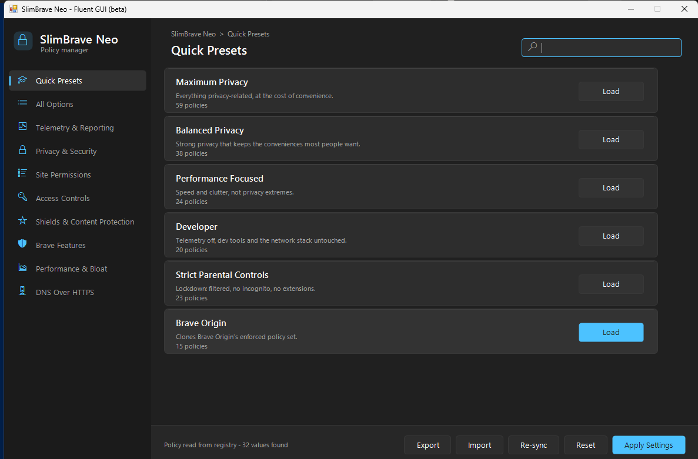

<div align="center">

# SlimBrave Neo


**Debloat and harden Brave Browser on Linux, macOS, and Windows.**

[](https://python.org)
[]()
[](LICENSE)
[]()
[]()
[]()

SlimBrave Neo uses Chromium enterprise managed policies to disable telemetry, bloat, and unwanted features in Brave Browser. No browser extensions, no hacks, just clean policy enforcement that Brave respects natively.

</div>

> [!NOTE]
> **Provenance and AI use.** SlimBrave Neo is a fork of [SlimBrave](https://github.com/ltx0101/SlimBrave) by [@ltx0101](https://github.com/ltx0101), extended to Linux and macOS and released under the same GPL-3.0 license.
>
> AI maintains this project; it did not write it. Claude re-audits every policy key against brave-core and Chromium source, catches drift between the three implementations, and helps with tests and docs. What ships is a human call. The receipts are in [`AUDIT.md`](AUDIT.md).

> [!IMPORTANT]
> **The only official source of SlimBrave Neo is this repository:**
> [`github.com/ChaoticSi1ence/SlimBrave-Neo`](https://github.com/ChaoticSi1ence/SlimBrave-Neo)
>
> This project ships **source code only**. Python and PowerShell scripts you can read before running.
> **There are no official `.exe`, `.msi`, `.dmg`, `.pkg`, installers, or compiled binaries.**
> If you find a download claiming to be SlimBrave-Neo elsewhere, it is not from this project. See [`SECURITY.md`](SECURITY.md).

> [!NOTE]
> **Linux users: consider [Brave Origin](https://brave.com/origin/linux/nightly/) first.**
> Brave Origin is a free, official Brave variant that ships with telemetry and bloat already removed. If you just want a clean Brave without configuration, that's the simpler path.
>
> The Linux version of SlimBrave Neo is still fully supported, and is the right tool if you want fine-grained control over individual policies, custom presets, or your own DoH templates beyond what Origin provides out of the box.

<div align="center">

---



*The Linux/macOS TUI: collapsible categories with a live count of what each one is managing, `/` to search, `?` for keys. Zero dependencies, runs in any terminal.*

</div>

---

## Quick Start

### Linux

```bash
git clone https://github.com/ChaoticSi1ence/SlimBrave-Neo.git
cd SlimBrave-Neo
sudo python3 slimbrave-linux.py
```

That's it. No `pip install`, no `jq`, no external dependencies. Just Python 3 and root.

#### The TUI

With no flags the script opens a curses interface: seven collapsible categories — Telemetry & Reporting, Privacy & Security, Site Permissions, Access Controls, Brave Features, Shields & Content Protection, Performance & Bloat — followed by a DNS Over HTTPS section, with an Import / Export / Apply / Reset / Quit button row underneath.

Each category header carries a disclosure marker and a live `n/m on` count of the settings under it that are actually managed — a ticked checkbox, or a selector sitting off *Not managed*. The count updates as you toggle, so a folded section still tells you whether anything inside it is set. Left folds a header, Right unfolds it, Space or Enter does either, and `c` folds every section at once — or unfolds them all when they are already folded. On launch the folds reflect what is already applied: a section holding a managed setting opens, the rest stay folded — so a clean machine opens on a short overview and a configured one opens on what it is enforcing.

`/` filters the list by row name. Matches narrow as you type, the hint line reports how many rows matched, and only matching rows and the headers owning them stay on screen. Folded sections are searched too, so a fold cannot hide a match. Esc clears the filter and puts the fold states back as they were before the search.

The eight tri-state permission rows render as `Web Notifications: < Block >` and are cycled with Left/Right, the same way the DNS mode selector has always worked; Space or Enter steps forward through the same states. A row sitting off *Not managed* is highlighted and counts toward the header above it.

`?` opens a key overlay over the list.

| Key | Action |
|-----|--------|
| Up / Down | Move the cursor; Down past the last row jumps to the button row |
| PageUp / PageDown | Move one screenful |
| Home / End | Jump to the first / last row |
| Left / Right | Cycle a selector, fold / unfold a header, or move along the button row |
| Space | Toggle a checkbox, cycle a selector, fold or unfold a header |
| Enter | The same, and presses the focused button |
| `c` | Fold every section, or unfold them all |
| `/` | Filter rows by name |
| Esc | Clear the filter; quit when no filter is active |
| `?` | Show the key overlay |
| Tab | Move between the list and the button row |
| `q` | Quit |

**CLI mode (non-interactive):**

```bash
sudo python3 slimbrave-linux.py --import "./Presets/Maximum Privacy Preset.json"
sudo python3 slimbrave-linux.py --export ~/SlimBraveNeoSettings.json
sudo python3 slimbrave-linux.py --reset
```

**Multiple Brave channels (Stable / Beta / Nightly):** Brave hardcodes the managed-policy directory to `/etc/brave/policies` for every channel, so a single policy file applies to all of them — no per-channel selector is needed. If multiple channels are installed, leaked Shields exceptions are scrubbed from each channel's user-data directory and "Brave is running" detection covers all installed channels.

After applying, restart Brave and verify at `brave://policy`.

### macOS

```bash
git clone https://github.com/ChaoticSi1ence/SlimBrave-Neo.git
cd SlimBrave-Neo
sudo python3 slimbrave-mac.py
```

Requires root. Policies are written to `/Library/Managed Preferences/com.brave.Browser.plist` by default; with `--persist on` an Apple Configuration Profile is installed instead.

The TUI is the same one [described under Linux](#the-tui) — same categories and live counts, same collapsing, `/` search, paging and `?` overlay, same Left/Right selectors — plus the two Apply-time prompts below.

**Persistence on macOS (Apple Silicon / macOS 13+).** On modern macOS, `cfprefsd` and `mdmclient` may clear directly-written `/Library/Managed Preferences/*.plist` files at reboot when no Configuration Profile backs them, so policies don't always survive a restart. SlimBrave Neo offers two modes:

| Mode | What it does | Persists | User action |
|------|--------------|----------|-------------|
| `off` (default) | Writes the plist only | may reset on macOS 13+ | just `sudo` |
| `on` | Installs an Apple Configuration Profile via System Settings | yes, durable | `sudo` + one-time GUI install |

When `--persist` is omitted on the CLI, the mode currently installed on the Mac is reused, so a re-run never silently demotes an installed profile back to plist-only. A fresh install defaults to `off`.

When you click Apply in the TUI, SlimBrave Neo asks two macOS-only questions in order: which Brave channels to manage (only when more than one is installed), then whether to persist across reboots. Both prompts have a sticky default — Enter keeps whichever scope and mode are currently installed.

```bash
sudo python3 slimbrave-mac.py --import "./Presets/Maximum Privacy Preset.json" --persist on
sudo python3 slimbrave-mac.py --import "./Presets/Maximum Privacy Preset.json" --persist off
sudo python3 slimbrave-mac.py --reset
```

**Finishing the Configuration Profile install (macOS 26).** With `--persist on`, SlimBrave Neo writes a `.mobileconfig` and opens System Settings, but macOS 11+ disallows CLI-driven profile installs so you finish the step in the GUI: a "Profile Downloaded" notification appears; in System Settings click **General** → **Device Management**, scroll down to **Downloaded**, double-click **SlimBrave Neo - Brave Policy**, click **Install**, and enter your login password. Policies then take effect immediately and persist across reboots. To uninstall, run `--reset` or remove the profile under the same Device Management pane. Reference: [Apple — Install configuration profiles on Mac](https://support.apple.com/guide/mac-help/mh35561/mac).

**CLI mode (non-interactive):**

```bash
sudo python3 slimbrave-mac.py --import "./Presets/Maximum Privacy Preset.json"
sudo python3 slimbrave-mac.py --export ~/SlimBraveNeoSettings.json
sudo python3 slimbrave-mac.py --reset
sudo python3 slimbrave-mac.py --import preset.json --channels stable,beta
sudo python3 slimbrave-mac.py --import preset.json --persist on
```

After applying, restart Brave and verify at `brave://policy`.

### Windows

```powershell
git clone https://github.com/ChaoticSi1ence/SlimBrave-Neo.git
cd SlimBrave-Neo
powershell -ExecutionPolicy Bypass -File .\SlimBrave.ps1
```

<div align="center">



*The Windows GUI, on All Options: every policy in one scroll, each with a plain-English description under its title. A sidebar splits them into categories, and the search reads the descriptions as well as the names.*

</div>

**No git?** One line:

```powershell
iwr "https://raw.githubusercontent.com/ChaoticSi1ence/SlimBrave-Neo/main/SlimBrave.ps1" -OutFile "SlimBrave.ps1"; powershell -ExecutionPolicy Bypass -File .\SlimBrave.ps1
```

This pulls the current `main`. If you'd rather pin an exact, unchanging version and check it against a published checksum before running, [`SECURITY.md`](SECURITY.md) covers tagged releases and SHA-256 sums.

> **"running scripts is disabled on this system"?**
> That is Windows' default execution policy (`Restricted`) refusing to run any
> `.ps1`, and it is why both commands above end in
> `powershell -ExecutionPolicy Bypass -File` rather than `.\SlimBrave.ps1`.
> The bypass applies to that one launch only — it changes no setting on your
> machine, and you never need `Set-ExecutionPolicy`. If you hit the error, you
> ran a copy of the one-liner without that part; re-run the version above.

**Prefer the previous layout?** [v2.1.0](https://github.com/ChaoticSi1ence/SlimBrave-Neo/releases/tag/v2.1.0)
is the last release with the three-column window. It keeps working; it just won't
receive the newer fixes. Pinned to that tag, either way:

```powershell
git clone -b v2.1.0 --depth 1 https://github.com/ChaoticSi1ence/SlimBrave-Neo.git
cd SlimBrave-Neo
powershell -ExecutionPolicy Bypass -File .\SlimBrave.ps1
```

```powershell
iwr "https://raw.githubusercontent.com/ChaoticSi1ence/SlimBrave-Neo/v2.1.0/SlimBrave.ps1" -OutFile "SlimBrave.ps1"; powershell -ExecutionPolicy Bypass -File .\SlimBrave.ps1
```

A tag never moves, so both of those fetch the same file every time.

Requires Administrator privileges; the script re-launches itself elevated. It opens showing the policy already on the machine.

**Every policy explains itself.** Each row carries a plain-English description under its title — *"Stops the daily usage ping that counts this install in Brave's active-user statistics"* — rather than hiding it in a tooltip. Where the text is longer than the row, a chevron expands it in place.

**Search reads the descriptions, not just the names.** The box in the header matches titles, policy keys, category names *and* the description text, so typing `passwords` surfaces "Require HTTPS for Basic Auth" even though its title never says the word, and `telemetry` returns the whole reporting section. Several words narrow the results, plurals match singulars, punctuation is ignored on both sides, and title matches rank above prose matches.

**A sidebar splits the policies into seven categories** — or skip it entirely: **All Options** lists all 78 in one scroll with section headers, for anyone who would rather not navigate.

**Presets are cards.** Each shows what it does and how many policies it sets. Loading one only fills in the controls; nothing reaches the registry until you press Apply Settings, so you can change your mind first. The presets are embedded in `SlimBrave.ps1` itself, so they work for the one-liner download above with no `Presets/` directory on disk.

**Clicking a label does nothing.** Only the toggle and the dropdown respond, each within its own bounds. Opening a menu is reversible; flipping a machine-wide policy is not.

The button row is Export, Import, **Re-sync**, Reset and Apply Settings. Re-sync reads the policy currently in the registry back into the interface, discarding on-screen selections you have not applied. It writes nothing, and goes through the same reader that fills the form at startup, so a re-sync can never disagree with a fresh launch.

Every row of Site Permissions is a dropdown rather than a checkbox: **Not managed / Ask / Block**, plus **Allow** on the keys where Chromium accepts it. Not managed is the default and writes nothing at all. The Site Permissions section below covers what each state does and which keys offer Allow.

---

## Features

### Telemetry & Reporting
- Disable Metrics Reporting (needs a restart)
- Disable Safe Browsing Reporting
- Disable URL Data Collection
- Disable P3A Analytics
- Disable Stats Ping
- Limit Variations to Critical Fixes, or Disable Variations / Griffin Experiments outright (mutually exclusive). Griffin is the remote seed Brave fetches to flip features in a browser that is already installed; "Limit" keeps the emergency security killswitches working, "Disable" blocks those too.
- Disable Enhanced Spell Check — mutually exclusive with Disable Spellcheck below; this row keeps offline checking and only drops the Google lookup

### Privacy & Security
- Disable Safe Browsing (security downgrade — Brave proxies these lookups through its own servers, so Google never sees them either way; excluded from every preset)
- Disable Autofill (Addresses & Credit Cards)
- Disable Password Manager
- Disable Password Leak Detection (the online breach-list credential check)
- Disable Browser Sign-in (needs a restart)
- Enable Global Privacy Control
- Enable De-AMP (strip Google AMP wrappers)
- Enable Debouncing (skip known tracking redirect hops)
- Strip Tracking URL Parameters
- Reduce Language Fingerprinting
- Disable WebRTC IP Leak
- Disable QUIC Protocol (needs a restart)
- Disable Network Prediction (no DNS prefetch / preconnect for links you never click)
- Block Third Party Cookies
- Block Payment Method Probing (sites' `canMakePayment` always answers "none saved")
- Disable Alternate Error Pages
- Block Remote Debugging (closes the CDP port and pipe automation tools drive the browser through — "Disable Developer Tools" does not cover it; breaks Puppeteer, Playwright and `brave://inspect`)
- Disable DNS Interception Probes (three random hostnames resolved at every launch and network change, visible to your ISP or DoH resolver)
- Require HTTPS for Basic Auth (breaks logins on legacy HTTP-only routers, printers and appliances)

### Site Permissions
Content-setting defaults sites are granted. These rows are **not checkboxes** — Chromium models these keys as an enum rather than a boolean, so the tool now exposes the enum instead of hardcoding "block". Each is a dropdown in the Windows GUI and a `< Block >`-style selector in the TUI, with the same states everywhere:

- **Not managed** — the default. Writes nothing at all, so Brave's own default and your per-site choices stand. An untouched row behaves exactly like the unticked checkbox it replaced.
- **Ask** — pins the permission prompt as managed policy: no site is silently granted, and the setting can't be weakened from `brave://settings` or per-site.
- **Block** — what ticking the box used to do. No prompt, no access, for any site.
- **Allow** — grants the permission to every site, and is offered **only on the keys where Chromium actually accepts it**.

**That last point is not uniform, and it isn't assumed to be.** Web Notifications, Location Access and Motion Sensors have an allow member (`1`) in their enum. WebUSB, Web Serial, WebHID, Local Font Enumeration and Window Management do **not** — `DefaultWebUsbGuardSetting`, `DefaultSerialGuardSetting`, `DefaultWebHidGuardSetting`, `DefaultLocalFontsSetting` and `DefaultWindowManagementSetting` are **Ask-or-Block only**, value `1` is not a member at all, and Brave rejects a policy file that names one. Those five rows never show an Allow entry. Checked key by key against Chromium `main`; the per-key legal enum is recorded in [`AUDIT.md`](AUDIT.md).

- Web Notifications — *Allow / Ask / Block*
- Location Access — *Allow / Ask / Block*; Block removes the prompt outright, so maps and delivery sites need an address typed by hand, and Ask is the middle ground
- Motion Sensors — *Allow / Ask / Block*; a fingerprinting vector, and blocking rarely breaks anything on desktop
- WebUSB Access — *Ask / Block*; Block breaks Ledger/Trezor web wallets and in-browser firmware flashers
- Web Serial Access — *Ask / Block*; Block breaks in-browser microcontroller programming tools
- WebHID Access — *Ask / Block*; Block may break security keys and gamepad configurators that use WebHID rather than WebAuthn
- Local Font Enumeration — *Ask / Block*; `queryLocalFonts()` hands over your installed font list, a strong fingerprint that Shields' font protections don't cover
- Multi-Screen Access — *Ask / Block*; the window-management permission: your monitor layout, plus placing windows on a chosen screen

Older configs keep working unchanged: a v1.9.5 export or preset naming one of these keys carries the value `2`, so it imports as **Block**, and a key the config doesn't name comes back as **Not managed**. A value outside a key's legal set is left unmanaged rather than written out, and the import result names the key it skipped.

### Access Controls
Lockdowns, and the escape hatches (guest, incognito, extensions) that would otherwise bypass the rest of the policy set — ordinary toggles:

- Force Google SafeSearch
- Filter Adult Content (SafeSites) — **this is a remote lookup, not a local filter.** Every URL you navigate to, including URLs loaded inside frames, is sent to Google's Safe Search API to be classified, and anything rated adult is blocked. Worth knowing in a tool whose other rows exist to keep Google out of your browsing; enable it only if the parental-control value is worth that trade.
- Disable Guest Mode (guest windows bypass profile restrictions)
- Block All Extensions (blocks new installs and disables existing ones — lockdown/parental setups)
- Block Sideloaded (External) Extensions (the silent registry / drop-in-file install channel bundleware uses; extensions you install yourself keep working)
- Disable / Force Incognito Mode (mutually exclusive; needs a restart)

### Brave Features
- Disable Brave Rewards
- Disable Brave Wallet
- Disable Brave VPN (no effect on Linux builds — Brave doesn't compile the VPN there, though `brave://policy` still reports the key as applied)
- Disable Brave AI Chat
- Disable Local AI (On-Device Models, Brave 1.94+) — stops the on-device model download and the AI index built from your history. Separate from AI Chat: turning Leo off does not cover it. Needs Brave 1.94 or newer (current stable); older versions ignore the key. Needs a restart.
- Disable Brave Shields / Force Shields On for all sites (mutually exclusive)
- Disable Brave News
- Disable Brave Talk
- Disable Brave Playlist
- Disable Web Discovery
- Disable Speedreader
- Disable Tor
- Disable Sync
- Disable Email Aliases

### Shields & Content Protection
Pin Brave's own protection defaults as managed policy so they can't be weakened per-site or in settings (requires Brave 1.84+; fingerprinting protection also works on 1.83):
- Enforce Ad Blocking
- Enforce Fingerprinting Protection
- Force HTTPS Upgrades (Strict — sites that can't serve HTTPS show an interstitial)
- Cap Referrers (Strict Origin) / Allow Permissive Referrers (mutually exclusive — both unchecked leaves referrer behavior unmanaged)
- Forget First-Party Storage on Close

> **Note on referrers:** with no referrer policy applied, Brave still caps cross-origin referrers by default, but you can loosen it per-site by lowering Shields on that site. "Allow Permissive Referrers" makes the loosening global as managed policy (`DefaultBraveReferrersSetting: 1`) — sites that request `unsafe-url` get your full referring URL cross-origin. It exists for compatibility with sites that break under capped referrers; it weakens privacy and is deliberately excluded from every preset.

### Performance & Bloat
- Disable Background Mode (Windows/Linux only — the policy doesn't exist on macOS)
- Enable Memory Saver (discard inactive tabs to free RAM)
- Force Hardware Acceleration (keeps rendering and video decode on the GPU; needs a restart)
- Disable Media Router (Cast, including its background LAN device discovery; needs a restart)
- Disable Media Recommendations
- Disable Shopping List
- Always Open PDF Externally
- Disable Translate
- Disable Spellcheck (all of it, offline included — mutually exclusive with Disable Enhanced Spell Check)
- Disable Search Suggestions
- Disable Printing
- Disable Default Browser Prompt
- Disable Developer Tools
- Disable Wayback Machine

### DNS Over HTTPS
- `unmanaged` by default — no DNS policy is written, so Brave's own DNS settings stay user-controlled
- Four managed modes: `automatic`, `off`, `secure`, `custom` (`off` force-disables DoH as policy)
- Custom DoH template URL support (e.g. `https://cloudflare-dns.com/dns-query`)
- Inline editable template field in the TUI
- `secure` and `custom` **require** a template URL and are refused without one. Chromium would otherwise apply the mode with an empty resolver list and resolve nothing at all — and being machine-managed policy, you couldn't fix it from `brave://settings`. `automatic` is exempt: an empty template there is valid, and a template is honoured if you set one.

---

## CLI Reference (Linux and macOS)

The Windows PowerShell script is GUI-only: it has no user-facing flags. It declares only the two internal parameters the elevation relaunch passes to itself, so use its Import and Export buttons instead.

| Flag | Description |
|------|-------------|
| `--import PATH` | Import a SlimBrave Neo JSON config and apply policies |
| `--export PATH` | Export current policy to a SlimBrave Neo JSON config |
| `--reset` | Remove the managed policy file |
| `--policy-file PATH` | Override policy file path |
| `--doh-templates URL` | Set custom DNS-over-HTTPS template URL |
| `--channels LIST` | Comma-separated channels to target (`stable,beta,nightly`; Linux also accepts `dev`). Default `auto` = all detected. macOS writes one plist per channel; Linux always shares a single policy file. |
| `--persist MODE` | **macOS only** (`slimbrave-mac.py`). `off` (plist only; may reset after reboot on macOS 13+) or `on` (install an Apple Configuration Profile via System Settings; durable, Apple-recommended). Omitted = reuse whatever mode is currently installed; falls back to `off` if nothing is. `slimbrave-linux.py` does not accept this flag at all and exits 2 if it is passed; `slimbrave-mac.py` run on Linux accepts only `off`, because `/etc/brave/policies` is already durable. |
| `-h`, `--help` | Show help |

Import/export uses the same JSON format as the Windows PowerShell version. Configs are cross-platform compatible.

---

<details>
<summary><strong>Presets</strong></summary>

A preset is a starting point, not a verdict — import it, untick whatever you don't want, then Apply. Every preset except Strict Parental turns off Background Mode; that policy is Windows/Linux only, so on macOS the key is skipped and the rest of the preset applies unchanged. None of the presets ships "Disable Safe Browsing", "Allow Permissive Referrers", or the two mutually-exclusive Shields overrides.

### Maximum Privacy Preset
- **Telemetry:** Turns off every reporting channel — metrics, extended Safe Browsing reports, URL-keyed data collection, P3A analytics, and the daily stats ping.
- **Safe Browsing:** Left **on**. Only the extended *reports* are disabled. Brave routes Safe Browsing lookups through its own servers rather than Google's, so switching the protection off would cost you phishing and malware interstitials for essentially no privacy gain — the "Disable Safe Browsing (security downgrade)" toggle is there if you disagree, but no preset sets it.
- **Privacy:** Disables autofill (addresses and cards), the password manager, leak detection, browser sign-in, WebRTC IP exposure, QUIC, network prediction and alternate error pages; blocks third-party cookies, payment-method probing, web notifications, location access, and motion sensors; enables Global Privacy Control, De-AMP, debouncing, tracking-parameter stripping, and reduced language fingerprinting. (Location Access is set to Block, not Ask — maps and delivery sites need addresses typed manually; drop the "Location Access" row to Ask, or to Not managed, if that is too strict.)
- **Brave Features:** Kills Rewards, Wallet, VPN, AI Chat, News, Talk, Playlist, Speedreader, Web Discovery, Tor, Sync, and Email Aliases.
- **Shields:** Pins ad blocking, fingerprinting protection, strict HTTPS, capped referrers, and forget-on-close storage as managed policy.
- **Performance and bloat — read this one before applying.** It goes well past "background processes": background mode, Cast device discovery, media recommendations, and the shopping list are off, and so are **developer tools, printing, the built-in PDF viewer** (PDFs download and open in your system viewer instead), **translation, spellcheck, search suggestions, and the default-browser prompt**. If you need devtools or printing, use the Developer preset, or untick those rows in the Performance & Bloat section before Apply.
- **DNS:** Left unmanaged. Forcing DoH off would hand every DNS query to your ISP in cleartext, while forcing DoH on concentrates that visibility at the DoH provider — which trade-off is right depends on who you distrust more, so the preset leaves the choice to you (set it manually in the DNS section if you have a preference).
- **Note:** No longer forces incognito-only browsing (earlier versions set `IncognitoModeAvailability: 2`, which silently disabled history, persistent logins, and most extensions). Forget-on-close storage covers the privacy goal; the Force Incognito toggle is still available manually.
- **New in 2.1:** on-device AI off, Chromium's per-launch DNS interception probes off, remote debugging blocked (the `--remote-debugging-port` cookie-theft vector `DeveloperToolsAvailability` never covered), Basic Auth refused over cleartext HTTP, the silent sideload-extension channel closed, and variations pinned to critical fixes only — Brave's A/B seed stops flipping features, security killswitches still arrive.
- **Deliberately not set:** the WebUSB / Web Serial / WebHID / Local Fonts / Multi-Screen dropdowns stay *Not managed* — blocking them breaks hardware wallets, flashers and some security keys. Flip them to Block yourself for the full lockdown.
- **Best for:** Paranoid users, journalists, activists, or anyone who wants Brave as private as possible — provided they read the performance bullet first.

### Balanced Privacy Preset
- **Telemetry:** Same five reporting channels as Maximum Privacy — metrics, extended Safe Browsing reports, URL-keyed collection, P3A, stats ping. Safe Browsing protection itself stays on.
- **Privacy:** Blocks third-party cookies, payment-method probing, network prediction and alternate error pages; enables Global Privacy Control, De-AMP, debouncing, tracking-parameter stripping, and reduced language fingerprinting; disables **QUIC** (all traffic falls back to TCP) and restricts **WebRTC** to proxied connections, which can break in-browser video and voice calls. Credit-card autofill is off, but address autofill and the password manager are deliberately kept.
- **Accounts:** Browser sign-in and **Brave Sync** are both disabled, so bookmarks, history and settings stop syncing across your devices. Untick "Disable Sync" and "Disable Browser Sign-in" before Apply if you rely on a sync chain.
- **Brave Features:** Disables Rewards, Wallet, VPN, AI Chat, News, Talk, Web Discovery, and **Tor** (the "New private window with Tor" option disappears).
- **Performance:** Turns off background mode, media recommendations, the shopping list, and the default-browser prompt.
- **DNS:** Uses automatic DoH (lets Brave choose the fastest secure DNS).
- **New in 2.1:** kills the enhanced-spellcheck web service while keeping offline spellcheck working — the exact balanced trade — plus on-device AI off, DNS interception probes off, remote debugging blocked, cleartext Basic Auth refused, sideloaded extensions blocked (your own extensions keep working), and variations limited to critical fixes.
- **Best for:** Most users who want privacy but still need convenience features — the password manager, address autofill, and Shields left at Brave's own defaults.

### Performance Focused Preset
- **Telemetry:** Blocks metrics reporting, P3A analytics, and the daily stats ping (Safe Browsing and its extended reports stay untouched).
- **Privacy:** The three no-cost speedups only — De-AMP, debouncing, and tracking-parameter stripping. Nothing else in Privacy & Security is touched.
- **Brave Features:** Disables Rewards, Wallet, VPN, AI Chat, News, Talk, Playlist, Speedreader, Web Discovery, and the Wayback Machine prompt to declutter the browser.
- **Performance:** Forces Memory Saver and hardware acceleration on; kills background mode, Cast device discovery, media recommendations, the shopping list, and the default-browser prompt. Network prediction is deliberately left on — prefetch makes browsing faster at a small privacy cost, which is the right trade for this preset.
- **DNS:** Automatic DoH for a balance of speed and security.
- **New in 2.1:** on-device AI off — Brave 1.94+ downloads and runs a local model and builds an AI index of your history; this preset's job is exactly that kind of background weight.
- **Best for:** Users who want a faster, cleaner Brave without extreme privacy tweaks.

### Developer Preset
- **Telemetry:** Blocks all five reporting channels (metrics, extended Safe Browsing reports, URL-keyed collection, P3A, stats ping).
- **Privacy:** Disables alternate error pages so you always see the real network error, never a suggestion page. Nothing else in Privacy & Security is touched.
- **Brave Features:** Disables Rewards, Wallet, VPN, AI Chat (Leo), News, and Talk.
- **Kept on purpose:** developer tools, printing, spellcheck, the built-in PDF viewer, QUIC, and Sync — the things the other presets take away and a developer needs back.
- **Performance:** Turns off background mode, media recommendations, the shopping list, and the default-browser prompt.
- **DNS:** Automatic DoH (default secure DNS).
- **New in 2.1:** variations pinned to critical fixes (a browser that doesn't reshuffle its features under your tests), on-device AI off, DNS interception probes off (three fewer phantom lookups in your network logs), and the enhanced-spellcheck web service off while offline spellcheck stays.
- **Remote debugging deliberately stays available.** Blocking it would break Puppeteer, Playwright and `brave://inspect` — the tools this preset exists to keep working.
- **Best for:** Developers who need dev tools and a working network stack but still want telemetry and Brave's monetised features out of the way.

### Strict Parental Controls Preset
- **Telemetry:** P3A analytics and the daily stats ping.
- **Privacy:** Blocks incognito mode **and guest mode** (a guest window would bypass every other restriction), forces Google SafeSearch, enables the SafeSites adult-content filter, disables browser sign-in and **Brave Sync**, and turns on De-AMP, debouncing, tracking-parameter stripping, and reduced language fingerprinting.
- **SafeSites is a Google callout.** `SafeSitesFilterBehavior` sends every URL the browser navigates to — including URLs loaded inside frames — to Google's Safe Search API for classification. It is a remote lookup, not a local blocklist. That is the price of the filter; if it isn't acceptable, untick "Filter Adult Content (SafeSites)" and rely on the DNS filter alone.
- **Extensions:** Blocks all extension installs and disables existing ones — a proxy or VPN extension would bypass the DNS filter.
- **Brave Features:** Disables Rewards, Wallet, VPN, AI Chat, News, Talk, Web Discovery, Tor, and developer tools.
- **DNS — no plaintext fallback.** The preset sets a custom DoH template of `https://family.cloudflare-dns.com/dns-query` (Cloudflare for Families). Custom mode is Chromium's **secure** DoH mode: Brave sends DNS-over-HTTPS queries *only*, and a lookup that fails is not retried against your system resolver. If that endpoint is blocked or unreachable — captive-portal Wi-Fi, some corporate and school networks — **nothing resolves at all** until you change the DNS mode back to `unmanaged` and re-Apply, or reset the policy entirely. Point it at a resolver you know works on the networks the machine will be used on.
- **New in 2.1:** remote debugging blocked — a debugging port is a scriptable side door past every filter this preset sets up.
- **Best for:** Parents, schools, or workplaces that need restricted browsing.

### Brave Origin Preset
Applies the policy half of what [Brave Origin](https://brave.com/origin/) upgrade mode enforces to a standard Brave install — the same feature kill-switches, through the same policy keys Origin itself sets.

- **The set is derived from source, not guessed:** the 15 keys and their exact values come from `brave_origin_service_factory.cc` in brave-core, the file where Origin defines what it enforces. Rewards, Wallet, VPN, AI Chat, Local AI, News, Talk, Playlist, Web Discovery, Speedreader, Wayback Machine, Email Aliases and Tor go off; P3A and the stats ping stop reporting.
- **Origin's 16th policy is deliberately absent.** `PsstEnabled` is not dispatched by any stable Brave and its feature flag is off everywhere, so SlimBrave Neo doesn't expose it — a switch that does nothing is worse than no switch. It gets added the release Brave makes it real (tracked in [`AUDIT.md`](AUDIT.md)).
- **What this can't give you:** Origin also compiles features out of the binary, ships with metrics removed, and adjusts a few defaults that have no policy equivalent. Policies can't shrink a binary. For the closest match, also tick "Disable Metrics Reporting" — Origin builds don't report metrics at all.
- **DNS:** Left unmanaged, matching Origin.
- **Best for:** Anyone who wants Origin's defaults on the Brave they already run — or on Windows and macOS, where Origin is a paid upgrade.

</details>

---

## How It Works

SlimBrave Neo writes Chromium [managed enterprise policies](https://chromeenterprise.google/policies/) to platform-specific locations. Brave reads these on startup and enforces the policies. No browser modifications needed.

| Platform | Policy Location |
|----------|----------------|
| Linux | `/etc/brave/policies/managed/slimbrave.json` (shared across all channels) |
| macOS — `--persist off` | `/Library/Managed Preferences/com.brave.Browser{,.beta,.nightly}.plist` (one per selected channel). |
| macOS — `--persist on` | Apple Configuration Profile installed via System Settings → General → Device Management. No plist files written; the profile system manages the values. |
| Windows | Registry keys via PowerShell |

**Additional behavior:**
- Auto-detects Brave installations: Arch (`brave-bin`), deb/rpm, Flatpak, Snap, macOS App (Stable / Beta / Nightly), and PATH fallback
- Reads existing policies on startup and pre-checks matching features; on macOS, the Apply-time channel prompt pre-ticks channels that already have a SlimBrave-managed policy (sticky default)
- Full overwrite on Apply, so unchecked features are cleanly removed
- Import/export compatible with the Windows PowerShell version: all three scripts now export UTF-8 without a BOM, and all three still read the UTF-16 files older PowerShell exports produced

---

<details>
<summary><strong>Requirements</strong></summary>

**Linux:**
- Python 3.9+ (no external dependencies)
- Root privileges (`sudo`)
- Brave Browser installed (any packaging method)

**macOS:**
- Python 3.9+ (no external dependencies)
- Root privileges (`sudo`)
- Brave Browser installed

**Windows:**
- Windows 10/11
- Windows PowerShell 5.1 (the one that ships with Windows — no install needed)
- Administrator privileges

3.9 is the floor CI lints against; the scripts themselves use nothing newer than 3.7 syntax.

</details>

<details>
<summary><strong>Windows: "Running Scripts is Disabled on this System"</strong></summary>

Launch the script the way the Quick Start does — the bypass applies to that one process and nothing else:

```powershell
powershell -ExecutionPolicy Bypass -File .\SlimBrave.ps1
```

You do not need to change your machine's execution policy for SlimBrave Neo, and you shouldn't: `Set-ExecutionPolicy RemoteSigned` with no `-Scope` defaults to `LocalMachine` and weakens script execution permanently, for every user on the box. If you want a lasting change anyway, scope it to yourself and know how to undo it:

```powershell
Set-ExecutionPolicy -ExecutionPolicy RemoteSigned -Scope CurrentUser   # apply
Set-ExecutionPolicy -ExecutionPolicy Undefined   -Scope CurrentUser   # undo
```

</details>

---

## Roadmap

- [x] Add preset configurations (Privacy, Performance, etc.)
- [x] Import/export settings (cross-platform compatible)
- [x] Add Linux support with full interactive TUI
- [x] DNS-over-HTTPS with custom template URLs
- [x] CLI mode for scripting and automation
- [x] macOS support via managed plist policies
- [x] Multi-channel support on macOS (Stable / Beta / Nightly)
- [x] Three-state permission settings (Allow / Ask / Block), not just block-or-nothing
- [x] Collapsible, searchable TUI
- [x] One-click presets in the Windows GUI

---

## Credits

- **[@ltx0101](https://github.com/ltx0101)** — [SlimBrave](https://github.com/ltx0101/SlimBrave), the upstream Windows PowerShell script this project grew out of (GPL-3.0)
- **[@alsyundawy](https://github.com/alsyundawy)** — macOS version
- **[@zhaoJianNet](https://github.com/zhaoJianNet)** — macOS refinements
- **[@cococool13](https://github.com/cococool13)** — the Permissions & Access category and 14 source-verified policies, shipped in v1.9.0

---

<div align="center">

**Like this project? Give it a star!**

Made with Python and PowerShell.

[](LICENSE)

</div>
